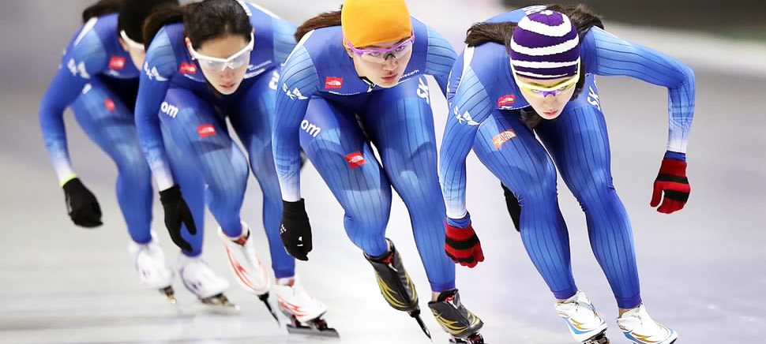

># Olympic Korea Skating Medals Analysis
>>It shows the data visualization based on Olympic data.
>>This is all about the main story which is the data of **Korea**. 
>>The data of Korea is compared to nations, gender, events and so on. 

## Getting Started
 This is a basic Python / Photoshop. If you wonder what any of steps these are, 
 click here : [Steps of analysis and design](https://docs.google.com/document/d/1zzZA53Vmzr8VtJMYylUWk9czaCjmr3XcGOeHqjR9S68/edit)

 Clone this to the location of your choice, get information the Olympic data of Korea! 

### Prerequisite
an endito, Git, python, photoshops and excel
 
### Author
1. Jiheui Yu - dev and desiner

### license
